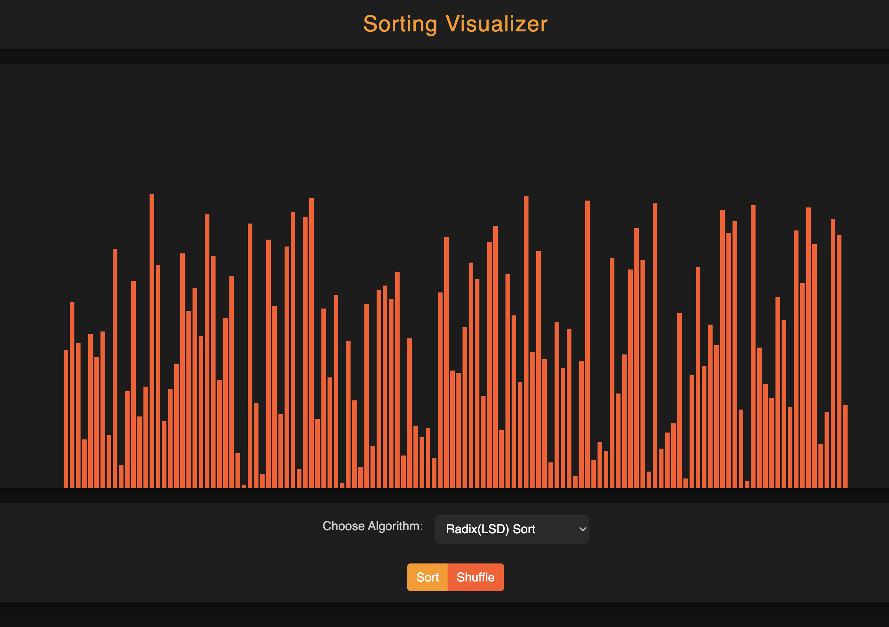
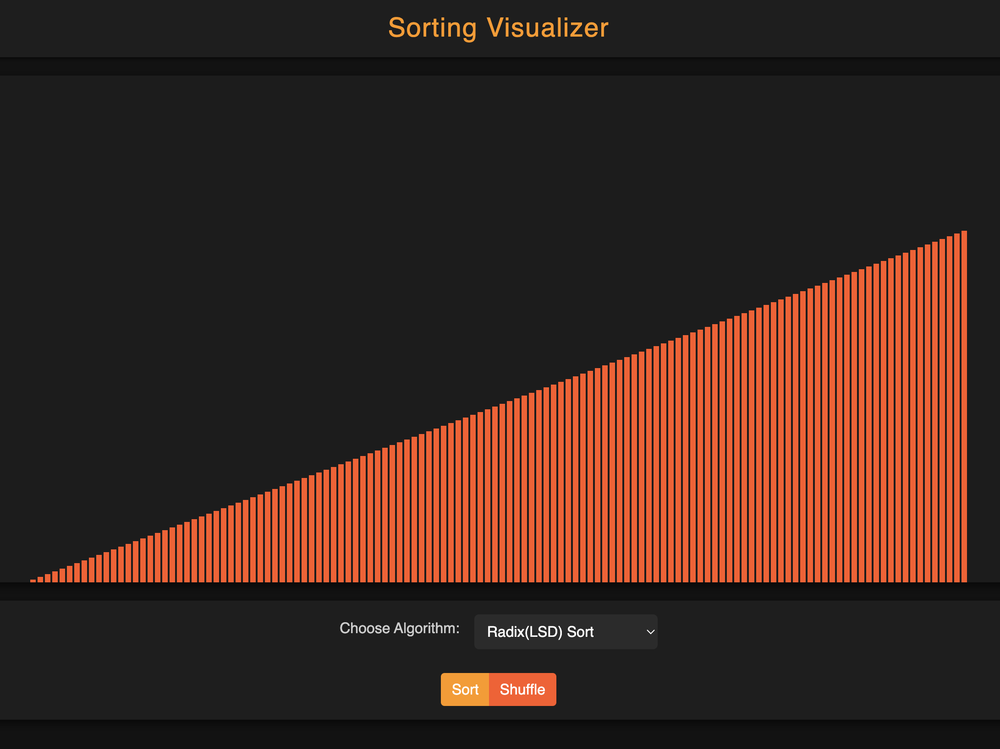

# Sort IT

Responsive visual representation of various sorting algorithms like Bubble, Selection, Merge, Comb, Counting sort etc. Built mainly using BootStrap, jQuery, JavaScript, HTML and CSS.


## Features

- 12 Sorting Algorithms to Chose From
- Each Step Animation Visible
- Options to Both Sort and Shuffle


## Screenshots




## Tech Stack

**FrontEnd:** BootStrap, HTML and CSS    
**Logic & Animation:** JavaScript and jQuery


## Demo

**Hosted Link:** https://all-sort-vis.netlify.app/  
## Run Locally

Clone the project

```bash
  git clone https://link-to-project
```

Open "home.html"


## Feedback

If you have any feedback, please reach out to us at akshat2006pandey@gmail.com

